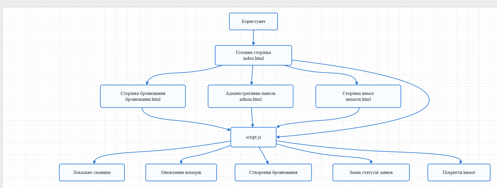

# Питання 2. Класифікація за масштабом. Класифікація з архітектури

## Питання

**Класифікація за масштабом. Класифікація з архітектури.**

## Відповідь

Класифікація програмної системи за масштабом показує, наскільки великою є система, яку кількість функцій вона містить, скільки ролей користувачів підтримує та яку частину предметної області охоплює.

Класифікація з архітектури показує, як побудована система, з яких частин вона складається, як ці частини взаємодіють між собою, де виконується логіка програми та де зберігаються дані.

У проєкті **«Програмна система “Готель”»** ці два види класифікації використовуються для того, щоб визначити розмір системи та показати її внутрішню побудову.

## Класифікація за масштабом

За масштабом програмні системи можна поділити на малі, середні, великі та корпоративні.

| Вид системи за масштабом | Характеристика                                                                                                | Приклад                                                                           |
| ------------------------ | ------------------------------------------------------------------------------------------------------------- | --------------------------------------------------------------------------------- |
| Мала система             | Має обмежену кількість функцій, просту структуру та невелику кількість користувачів                           | Невеликий вебзастосунок для перегляду номерів і створення бронювань               |
| Середня система          | Має кілька модулів, різні ролі користувачів, збереження даних і розширену логіку                              | Система керування готелем із клієнтом, адміністратором, бронюваннями та звітністю |
| Велика система           | Охоплює багато підсистем, підтримує значну кількість користувачів, серверну частину, базу даних та інтеграції | Повноцінна система для мережі готелів з онлайн-оплатою, CRM і бухгалтерією        |
| Корпоративна система     | Використовується на рівні організації або мережі організацій і підтримує багато бізнес-процесів               | ERP-система для готельної мережі                                                  |

Поточна реалізація проєкту **«Програмна система “Готель”»** належить до **малої навчальної вебсистеми**, тому що вона має обмежений, але завершений набір функцій: перегляд номерів, створення бронювання, збереження заявки, адміністративне керування заявками, зміну статусів і сторінку покриття вимог.

Водночас за структурою проєкт уже має ознаки основи для **середньої інформаційної системи**, тому що в ньому є кілька окремих частин: клієнтський інтерфейс, сторінка бронювання, адміністративна панель, сторінка вимог, серверна частина та збереження даних у JSON-файлах.

## Класифікація з архітектури

За архітектурою програмні системи класифікують залежно від того, як організовані їхні компоненти та як між ними передаються дані.

| Тип архітектури                 | Характеристика                                                                        | Особливість                                                           |
| ------------------------------- | ------------------------------------------------------------------------------------- | --------------------------------------------------------------------- |
| Монолітна архітектура           | Усі частини системи працюють як єдиний застосунок                                     | Проста для реалізації, але складніша для масштабування                |
| Клієнт-серверна архітектура     | Клієнтська частина взаємодіє із сервером, а сервер обробляє запити та працює з даними | Підходить для систем із кількома сторінками, API та збереженням даних |
| Багаторівнева архітектура       | Система поділена на рівні: інтерфейс, бізнес-логіка, дані                             | Зручна для складних систем із чітким розподілом відповідальності      |
| Мікросервісна архітектура       | Система складається з окремих незалежних сервісів                                     | Підходить для великих корпоративних систем                            |
| Статична клієнтська архітектура | Система працює тільки у браузері без серверної частини                                | Підходить для простих демонстраційних вебпроєктів                     |

Після доопрацювання проєкт **«Програмна система “Готель”»** належить до **клієнт-серверної вебархітектури**.

Клієнтська частина системи складається з HTML-сторінок, CSS-оформлення та JavaScript-логіки. Користувач взаємодіє з інтерфейсом через сторінки: головну сторінку, сторінку бронювання, адміністративну панель і сторінку вимог.

Серверна частина реалізована на **Node.js + Express**. Вона приймає запити від клієнтської частини, обробляє їх і працює з даними номерів та бронювань. Дані зберігаються у JSON-файлах.

## Реалізація архітектури в системі «Готель»

У програмній системі **«Готель»** архітектура побудована за принципом поділу на клієнтську та серверну частини.

| Компонент системи    | Призначення                                                                                    |
| -------------------- | ---------------------------------------------------------------------------------------------- |
| `index.html`         | Головна сторінка для перегляду номерів, переходу до бронювання, адмін-панелі та сторінки вимог |
| `booking.html`       | Сторінка створення бронювання                                                                  |
| `admin.html`         | Адміністративна панель для перегляду та керування заявками                                     |
| `requirements.html`  | Сторінка покриття вимог і додаткових класифікацій системи                                      |
| `style.css`          | Оформлення інтерфейсу системи                                                                  |
| `script.js`          | Клієнтська логіка: робота з формами, отримання даних, оновлення сторінок                       |
| `server.js`          | Серверна частина, яка обробляє API-запити                                                      |
| `data/rooms.json`    | Файл з даними номерів                                                                          |
| `data/bookings.json` | Файл з даними бронювань                                                                        |

Користувач відкриває сторінки системи у браузері. Клієнтська частина через JavaScript надсилає запити до серверної частини. Сервер обробляє ці запити, читає або змінює дані у JSON-файлах і повертає результат назад у браузер.

Наприклад, коли користувач створює бронювання, дані з форми передаються на сервер. Сервер створює нову заявку, зберігає її та оновлює стан номера. Після цього інтерфейс показує актуальні дані.

## Архітектурна схема системи

Для цього питання основним доказом є архітектурна схема програмної системи **«Готель»**, тому що саме вона показує масштаб системи та її побудову.

### Рисунок 1 — Архітектурна схема програмної системи «Готель»

На рисунку показано основні частини системи: користувача, головну сторінку, сторінку бронювання, адміністративну панель, сторінку вимог, спільну логіку `script.js`, локальне/серверне збереження даних та основні процеси системи.

Схема підтверджує, що система не є одним окремим файлом або випадковим набором сторінок. Вона має структуровану побудову: користувач працює з інтерфейсом, сторінки пов’язані між собою, логіка винесена в окремий JavaScript-файл, а дані зберігаються окремо від інтерфейсу.

## Класифікація системи «Готель» за масштабом і архітектурою

| Ознака класифікації | Визначення для проєкту «Готель»            | Пояснення                                                   |
| ------------------- | ------------------------------------------ | ----------------------------------------------------------- |
| Масштаб             | Мала навчальна вебсистема                  | Має обмежений, але завершений набір функцій                 |
| Потенціал розвитку  | Основа для середньої інформаційної системи | Є окремі модулі, серверна частина та збереження даних       |
| Предметна область   | Інформаційна система для готелю            | Система працює з номерами, клієнтами, заявками та статусами |
| Основні ролі        | Клієнт і адміністратор                     | Клієнт створює бронювання, адміністратор керує заявками     |
| Архітектура         | Клієнт-серверна вебархітектура             | Клієнтська частина взаємодіє із серверною частиною          |
| Клієнтська частина  | HTML, CSS, JavaScript                      | Відповідає за інтерфейс і взаємодію користувача з системою  |
| Серверна частина    | Node.js + Express                          | Обробляє запити та працює з даними                          |
| Збереження даних    | JSON-файли                                 | Дані номерів і бронювань зберігаються окремо від інтерфейсу |

## Висновок

Отже, за масштабом **«Програмна система “Готель”»** належить до малих навчальних вебсистем, оскільки має обмежений, але завершений набір функцій: перегляд номерів, створення бронювання, адміністративне керування, зміну статусів і перевірку вимог.

За архітектурою система належить до клієнт-серверних вебзастосунків. Вона має клієнтську частину, серверну частину та окреме збереження даних. Клієнтська частина відповідає за інтерфейс, серверна частина — за обробку запитів, а JSON-файли — за збереження номерів і бронювань.

Архітектурна схема підтверджує, що система має структуровану побудову та може бути розширена в майбутньому: наприклад, додаванням бази даних, авторизації користувачів, ролей, онлайн-оплати та повноцінної роботи з багатьма користувачами.

