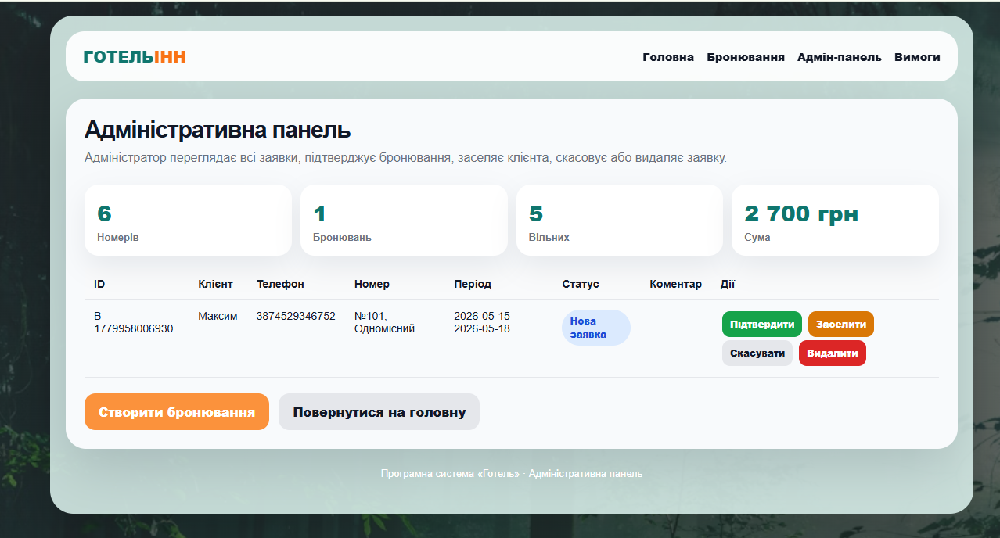
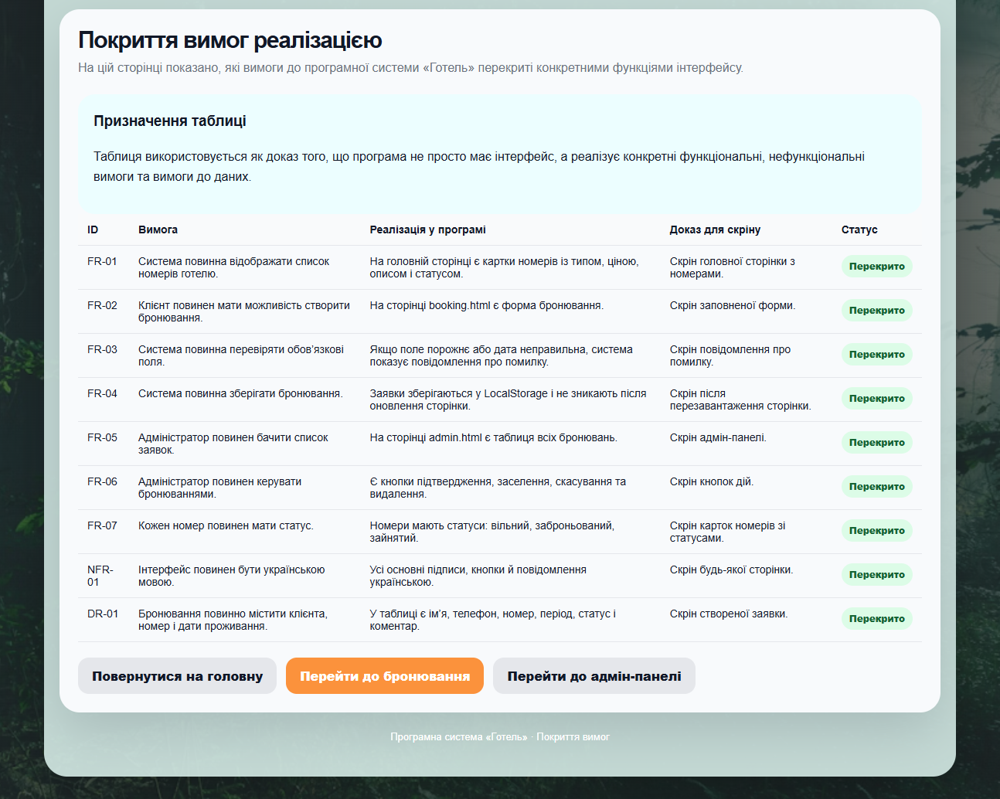

# Питання 4. Класифікація за системою подання даних

## Питання

**Класифікація за системою подання даних.**

## Відповідь

Класифікація за системою подання даних показує, у якій формі інформація відображається користувачу в програмній системі. Тобто важливо не лише те, які дані система зберігає або обробляє, а й те, як саме ці дані показані в інтерфейсі.

Дані можуть подаватися у вигляді тексту, таблиць, форм, карток, статусів, кнопок, повідомлень, зображень або статистичних блоків. Вибір способу подання залежить від того, що саме користувач повинен зробити з цією інформацією: переглянути, ввести, порівняти, змінити, підтвердити або проконтролювати.

У проєкті **«Програмна система “Готель”»** використовується комбінована система подання даних. Це означає, що інформація подається не одним способом, а через різні елементи інтерфейсу: картки номерів, форму бронювання, таблицю заявок, статуси, кнопки дій, повідомлення та таблицю покриття вимог.

## Основні способи подання даних

| Спосіб подання даних | Що означає                                                | Приклад у системі «Готель»                                        |
| -------------------- | --------------------------------------------------------- | ----------------------------------------------------------------- |
| Текстове подання     | Дані подаються через назви, підписи, описи й повідомлення | Назви сторінок, описи номерів, повідомлення про результат дії     |
| Карткове подання     | Кожен об’єкт подається як окремий візуальний блок         | Картки номерів на головній сторінці                               |
| Графічне подання     | Дані доповнюються зображеннями або візуальними елементами | Фото номерів і візуальні блоки на головній сторінці               |
| Формове подання      | Користувач вводить дані через поля форми                  | Форма створення бронювання                                        |
| Табличне подання     | Дані організовані у рядки та стовпці                      | Таблиця бронювань в адмін-панелі, таблиця покриття вимог          |
| Статусне подання     | Стан об’єкта показується через окрему позначку            | Статуси номерів і бронювань                                       |
| Кнопкове подання     | Дії користувача подаються через кнопки                    | «Забронювати», «Підтвердити», «Заселити», «Скасувати», «Видалити» |
| Узагальнене подання  | Короткий підсумок стану системи                           | Кількість номерів, бронювань, вільних номерів і сума              |

## Реалізація в програмній системі «Готель»

У системі **«Готель»** дані подаються кількома способами залежно від призначення сторінки.

На головній сторінці використовується карткове, графічне, текстове, статусне та кнопкове подання даних. Номери готелю показані у вигляді карток. Кожна картка містить фото, номер кімнати, тип номера, опис, ціну, статус і кнопку вибору. Такий спосіб подання зручний для клієнта, тому що він може швидко переглянути доступні номери й обрати потрібний варіант.

На сторінці бронювання використовується формове подання даних. Користувач вводить ім’я, телефон, дату заїзду, дату виїзду, обирає номер і може додати коментар. Форма дозволяє системі отримати структуровані дані для створення заявки.

В адміністративній панелі використовується табличне, статусне, кнопкове та узагальнене подання даних. У таблиці адміністратор бачить заявки клієнтів, телефони, номери, періоди проживання, статуси та коментарі. Кнопки дій дозволяють підтвердити бронювання, заселити клієнта, скасувати або видалити заявку. Статистичні блоки показують загальну кількість номерів, бронювань, вільних номерів і суму.

На сторінці **«Покриття вимог реалізацією»** використовується табличне подання документаційних даних. У таблиці показано ID вимоги, її формулювання, реалізацію у програмі, доказ для скріну та статус виконання. Це дозволяє структуровано показати зв’язок між вимогами та реалізованими функціями системи.

## Класифікація подання даних у системі «Готель»

| Система подання даних | Де використовується               | Що показує                                           |
| --------------------- | --------------------------------- | ---------------------------------------------------- |
| Текстова              | На всіх сторінках                 | Назви розділів, підписи полів, описи, повідомлення   |
| Карткова              | Головна сторінка                  | Номери готелю у вигляді окремих карток               |
| Графічна              | Головна сторінка                  | Фото номерів і візуальні блоки                       |
| Формова               | Сторінка бронювання               | Поля введення даних клієнта                          |
| Таблична              | Адмін-панель і сторінка вимог     | Список бронювань і таблиця покриття вимог            |
| Статусна              | Головна сторінка й адмін-панель   | Стани номерів і заявок                               |
| Кнопкова              | Головна, бронювання, адмін-панель | Переходи між сторінками та керування заявками        |
| Узагальнена           | Адмін-панель                      | Кількість номерів, бронювань, вільних номерів і сума |

## Підтвердження реалізації

Для цього питання використовуються тільки ті скріни, які прямо підтверджують різні способи подання даних у системі.

| № | Скрін                                                               | Що підтверджує                                                   |
| - | ------------------------------------------------------------------- | ---------------------------------------------------------------- |
| 1 | [Головна сторінка системи](screenshots/01-main-page.png)            | Карткове, графічне, текстове, статусне та кнопкове подання даних |
| 2 | [Сторінка створення бронювання](screenshots/02-booking-created.png) | Формове, текстове, кнопкове та контрольне подання даних          |
| 3 | [Адміністративна панель](screenshots/04-admin-panel.png)            | Табличне, статусне, кнопкове й узагальнене подання даних         |
| 4 | [Таблиця покриття вимог](screenshots/03-requirements-coverage.png)  | Табличне подання документаційної інформації                      |

### Рисунок 1 — Карткове, графічне та статусне подання даних на головній сторінці

На рисунку показано головну сторінку системи **«Готель»**. Номери подані у вигляді окремих карток із фото, назвою, типом, ціною, описом і статусом. Це підтверджує карткове, графічне, текстове та статусне подання даних.

Також на сторінці є кнопки переходу до бронювання, адміністративної панелі та сторінки вимог. Це підтверджує кнопкове подання дій користувача.

### Рисунок 2 — Формове подання даних на сторінці бронювання

На рисунку показано форму створення бронювання. Користувач вводить дані через окремі поля: ім’я, телефон, дату заїзду, дату виїзду, номер і коментар. Це підтверджує формове подання даних.

Повідомлення про успішне створення бронювання підтверджує контрольне подання результату дії користувача.

### Рисунок 3 — Табличне, статусне та узагальнене подання даних в адміністративній панелі

На рисунку показано адміністративну панель. Дані бронювань подані у вигляді таблиці: ID, клієнт, телефон, номер, період, статус, коментар і дії. Це підтверджує табличне подання даних.

Статус заявки показано окремою позначкою, а кнопки дій дозволяють адміністратору керувати бронюванням. Статистичні блоки зверху показують узагальнену інформацію: кількість номерів, бронювань, вільних номерів і суму.

### Рисунок 4 — Табличне подання документаційної інформації на сторінці вимог

На рисунку показано таблицю покриття вимог реалізацією. Дані подані у вигляді рядків і стовпців: ID вимоги, формулювання, реалізація у програмі, доказ для скріну та статус виконання. Це підтверджує табличне подання документаційної інформації.

## Висновок

Отже, у програмній системі **«Готель»** використовується комбінована система подання даних. Інформація подається через текст, картки, зображення, форми, таблиці, статуси, кнопки та статистичні блоки.

Такий підхід робить систему зрозумілою для користувача. Клієнт може швидко переглянути номери та створити бронювання, а адміністратор — побачити всі заявки, змінити їх статус і проконтролювати загальний стан системи.

Класифікація за системою подання даних показує, що проєкт **«Програмна система “Готель”»** має не лише функціональну логіку, а й продуманий спосіб відображення інформації для різних сценаріїв роботи.
