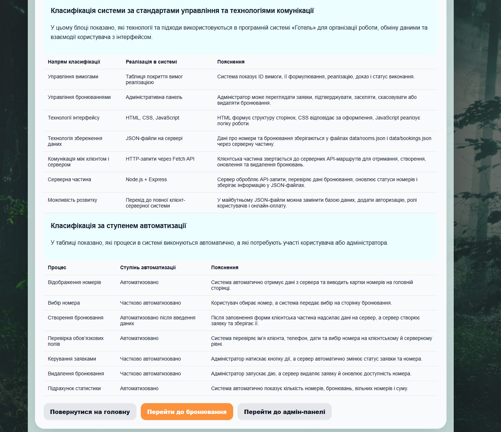

# Питання 5. Класифікація за підтримуваними стандартами управління і технологіями комунікації. Класифікація за ступенем автоматизації

## Питання

**Класифікація за підтримуваними стандартами управління і технологіями комунікації. Класифікація за ступенем автоматизації.**

## Відповідь

Класифікація за підтримуваними стандартами управління і технологіями комунікації показує, які підходи, технології та механізми використовуються в програмній системі для організації роботи, обміну даними, взаємодії користувача з інтерфейсом і керування процесами.

Класифікація за ступенем автоматизації показує, які процеси система виконує автоматично, а які потребують участі користувача або адміністратора.

У проєкті **«Програмна система “Готель”»** ці класифікації використовуються для того, щоб показати, як система організовує роботу з бронюваннями, як передає та зберігає дані, які технології використовує і які дії автоматизує.

Після доопрацювання система працює як клієнт-серверний вебзастосунок. Користувач взаємодіє з клієнтською частиною через вебсторінки, а дані про номери та бронювання обробляються через серверну частину. Це дозволяє показати не лише інтерфейс, а й реальний механізм обміну даними між клієнтом і сервером.

## Класифікація за підтримуваними стандартами управління

У межах навчального проєкту **«Готель»** не використовується повноцінний корпоративний стандарт рівня ERP, CRM, ITIL або ISO-системи. Проте в програмі реалізовано базові елементи управління вимогами, бронюваннями, статусами та даними.

Управління в системі проявляється через такі елементи:

| Напрям управління         | Реалізація в системі «Готель»        | Пояснення                                                                                            |
| ------------------------- | ------------------------------------ | ---------------------------------------------------------------------------------------------------- |
| Управління вимогами       | Таблиця покриття вимог реалізацією   | Система показує ID вимоги, її формулювання, реалізацію, доказ і статус виконання                     |
| Управління бронюваннями   | Адміністративна панель               | Адміністратор може переглядати заявки, підтверджувати, заселяти, скасовувати або видаляти бронювання |
| Управління станом номерів | Статуси номерів                      | Номери мають стани: вільний, заброньований, зайнятий                                                 |
| Управління даними клієнта | Форма бронювання та таблиця заявок   | Клієнт вводить дані, а система зберігає їх як заявку                                                 |
| Контроль виконання дій    | Повідомлення та оновлення інтерфейсу | Після створення бронювання система показує повідомлення про успішне збереження                       |
| Простежуваність вимог     | Сторінка «Вимоги»                    | Для кожної вимоги показано, якою функцією вона реалізована                                           |

Таким чином, система підтримує навчальний підхід до управління: вимоги пов’язуються з реалізацією, бронювання мають статуси, а адміністратор може контролювати процес обробки заявок.

## Класифікація за технологіями комунікації

Технології комунікації показують, як користувач взаємодіє з програмою і як частини системи передають дані між собою.

У проєкті **«Готель»** після доопрацювання використовується клієнт-серверна комунікація. Користувач працює з HTML-сторінками у браузері, клієнтська частина надсилає HTTP-запити до серверної частини, сервер обробляє ці запити та працює з файлами даних.

Основні технології комунікації в системі:

| Технологія / механізм | Реалізація в системі                | Призначення                                                       |
| --------------------- | ----------------------------------- | ----------------------------------------------------------------- |
| HTML                  | Сторінки інтерфейсу системи         | Формує структуру сторінок                                         |
| CSS                   | Оформлення інтерфейсу               | Відповідає за зовнішній вигляд сторінок, кнопок, таблиць і карток |
| JavaScript            | Клієнтська логіка                   | Обробляє дії користувача та оновлює інтерфейс                     |
| Fetch API             | HTTP-запити між клієнтом і сервером | Забезпечує отримання, створення, оновлення та видалення даних     |
| Node.js               | Серверне середовище виконання       | Забезпечує роботу серверної частини                               |
| Express               | Серверний фреймворк                 | Обробляє API-запити від клієнтської частини                       |
| JSON-файли            | Файли з даними номерів і бронювань  | Використовуються для збереження інформації                        |
| HTTP API              | Маршрути сервера                    | Забезпечують обмін даними між браузером і сервером                |

Отже, за технологіями комунікації система **«Готель»** належить до клієнт-серверних вебзастосунків, у яких клієнтська частина працює у браузері, а серверна частина обробляє запити та зберігає дані.

## Серверна частина системи

У доопрацьованій версії проєкту додано серверну частину. Вона потрібна для того, щоб система не зберігала всі дані лише у браузері, а могла працювати через серверні API-маршрути.

Серверна частина виконує такі функції:

| Функція сервера            | Призначення                                              |
| -------------------------- | -------------------------------------------------------- |
| Отримання списку номерів   | Сервер передає клієнтській частині дані про номери       |
| Отримання списку бронювань | Сервер передає список створених заявок                   |
| Створення бронювання       | Сервер приймає дані з форми та додає нову заявку         |
| Оновлення статусу заявки   | Сервер змінює статус бронювання після дії адміністратора |
| Видалення бронювання       | Сервер видаляє заявку зі списку                          |
| Збереження даних           | Дані зберігаються у файлах на серверній стороні          |

У системі використовуються такі API-маршрути:

| API-маршрут                | Призначення                    |
| -------------------------- | ------------------------------ |
| `GET /api/rooms`           | Отримання списку номерів       |
| `GET /api/bookings`        | Отримання списку бронювань     |
| `POST /api/bookings`       | Створення нового бронювання    |
| `PATCH /api/bookings/:id`  | Оновлення статусу бронювання   |
| `DELETE /api/bookings/:id` | Видалення бронювання           |
| `POST /api/reset`          | Скидання демонстраційних даних |

Це означає, що система вже не є лише статичною сторінкою. Вона має окрему серверну частину, яка відповідає за обробку даних і взаємодію з клієнтським інтерфейсом.

## Класифікація за ступенем автоматизації

За ступенем автоматизації системи можна поділити на ручні, частково автоматизовані, автоматизовані та автоматичні.

| Ступінь автоматизації           | Характеристика                                                                 | Приклад                                                          |
| ------------------------------- | ------------------------------------------------------------------------------ | ---------------------------------------------------------------- |
| Ручна система                   | Усі дії виконує людина без програмної підтримки                                | Запис бронювань у паперовий журнал                               |
| Частково автоматизована система | Частину дій виконує програма, але рішення приймає користувач або адміністратор | Адміністратор сам підтверджує або скасовує бронювання            |
| Автоматизована система          | Основні операції виконуються програмою після дії користувача                   | Система створює заявку, зберігає її та змінює статус номера      |
| Автоматична система             | Система працює майже без участі людини                                         | Автоматичне підтвердження, оплата й заселення без адміністратора |

Проєкт **«Програмна система “Готель”»** належить до **частково автоматизованих систем**.

Це пояснюється тим, що система автоматизує багато технічних операцій: відображення номерів, створення бронювання, перевірку форми, збереження заявки, оновлення таблиць, зміну статусів і підрахунок статистики. Але остаточні управлінські дії залишаються за адміністратором: він сам вирішує, чи підтвердити бронювання, заселити клієнта, скасувати або видалити заявку.

Тобто система не замінює адміністратора повністю, а автоматизує рутинні операції та допомагає швидше керувати бронюваннями.

## Що автоматизовано в системі «Готель»

| Процес                       | Ступінь автоматизації               | Пояснення                                                                         |
| ---------------------------- | ----------------------------------- | --------------------------------------------------------------------------------- |
| Відображення номерів         | Автоматизовано                      | Система отримує дані та виводить картки номерів на головній сторінці              |
| Вибір номера                 | Частково автоматизовано             | Користувач обирає номер, а система передає вибір на сторінку бронювання           |
| Створення бронювання         | Автоматизовано після введення даних | Після заповнення форми система створює заявку                                     |
| Перевірка обов’язкових полів | Автоматизовано                      | Система перевіряє ім’я клієнта, телефон, дати та вибір номера                     |
| Збереження даних             | Автоматизовано                      | Дані зберігаються через серверну частину                                          |
| Керування заявками           | Частково автоматизовано             | Адміністратор натискає кнопку, а система змінює статус заявки та номера           |
| Видалення бронювання         | Частково автоматизовано             | Адміністратор запускає дію, а система видаляє заявку й оновлює доступність номера |
| Підрахунок статистики        | Автоматизовано                      | Система показує кількість номерів, бронювань, вільних номерів і суму              |
| Контроль покриття вимог      | Частково автоматизовано             | Таблиця вимог відображається в системі, але самі вимоги визначаються розробником  |

## Реалізація в програмній системі «Готель»

У програмній системі **«Готель»** користувач працює з вебінтерфейсом. На головній сторінці він переглядає доступні номери, їх типи, ціни, описи й статуси. Через кнопки переходу користувач може перейти до сторінки бронювання, адміністративної панелі або сторінки вимог.

На сторінці бронювання користувач вводить дані для створення заявки. Після натискання кнопки **«Забронювати»** клієнтська частина перевіряє введені дані та передає їх на сервер. Сервер створює нове бронювання, зберігає його та оновлює стан номера.

В адміністративній панелі адміністратор бачить список заявок. За допомогою кнопок він може підтвердити бронювання, заселити клієнта, скасувати або видалити заявку. Після натискання кнопки сервер оновлює дані, а інтерфейс показує актуальний стан.

На сторінці **«Вимоги»** додано окремий блок класифікації системи за стандартами управління, технологіями комунікації та ступенем автоматизації. Це дозволяє показати не лише теоретичну відповідь у звіті, а й реальну реалізацію цієї класифікації в самій програмі.

## Класифікація системи «Готель» за цими ознаками

| Ознака класифікації          | Визначення для проєкту «Готель»                                    | Пояснення                                                     |
| ---------------------------- | ------------------------------------------------------------------ | ------------------------------------------------------------- |
| За стандартами управління    | Навчальна система з елементами управління вимогами та бронюваннями | Є таблиця покриття вимог і адміністративне керування заявками |
| За технологіями комунікації  | Клієнт-серверний вебзастосунок                                     | Клієнтська частина взаємодіє із сервером через HTTP-запити    |
| За способом обміну даними    | HTTP-запити через Fetch API                                        | Дані передаються між браузером і сервером                     |
| За способом збереження даних | JSON-файли на сервері                                              | Номери та бронювання зберігаються на серверній стороні        |
| За серверною технологією     | Node.js + Express                                                  | Сервер обробляє API-запити                                    |
| За ступенем автоматизації    | Частково автоматизована система                                    | Частину операцій виконує програма, частину — адміністратор    |
| За роллю користувача         | Клієнтсько-адміністративна система                                 | Клієнт створює бронювання, адміністратор керує заявками       |

## Підтвердження реалізації

Для цього питання використовується один основний доказ — скрін сторінки **«Вимоги»**, де безпосередньо додано таблиці класифікації системи за стандартами управління, технологіями комунікації та ступенем автоматизації.

### Рисунок 1 — Класифікація програмної системи «Готель» за стандартами управління, технологіями комунікації та ступенем автоматизації

На рисунку показано блок сторінки **«Вимоги»**, де наведено дві таблиці. Перша таблиця показує класифікацію системи за стандартами управління та технологіями комунікації: управління вимогами, управління бронюваннями, технології інтерфейсу, технологію збереження даних, комунікацію між клієнтом і сервером та серверну частину.

Друга таблиця показує класифікацію за ступенем автоматизації. У ній визначено, які процеси виконуються автоматично, а які є частково автоматизованими: відображення номерів, вибір номера, створення бронювання, перевірка обов’язкових полів, керування заявками, видалення бронювання та підрахунок статистики.

Цей скрін безпосередньо підтверджує відповідь на питання, тому що саме на ньому показано класифікацію системи за підтримуваними стандартами управління, технологіями комунікації та ступенем автоматизації.

## Висновок

Отже, за підтримуваними стандартами управління проєкт **«Програмна система “Готель”»** можна віднести до навчальних систем з елементами управління вимогами та бронюваннями. У ньому реалізовано таблицю покриття вимог, адміністративне керування заявками, статуси номерів і бронювань.

За технологіями комунікації система є клієнт-серверним вебзастосунком. Клієнтська частина використовує HTML, CSS, JavaScript і Fetch API, а серверна частина побудована на Node.js + Express. Дані зберігаються у JSON-файлах на серверній стороні.

За ступенем автоматизації система є частково автоматизованою. Вона автоматизує створення бронювання, перевірку даних, збереження заявок, зміну статусів, оновлення таблиць і підрахунок статистики, але ключові адміністративні рішення залишаються за людиною.

Такий підхід відповідає навчальному проєкту: система має зрозумілу організацію управління, підтримує сучасні вебтехнології комунікації та демонструє практичну автоматизацію процесу бронювання в готелі.
