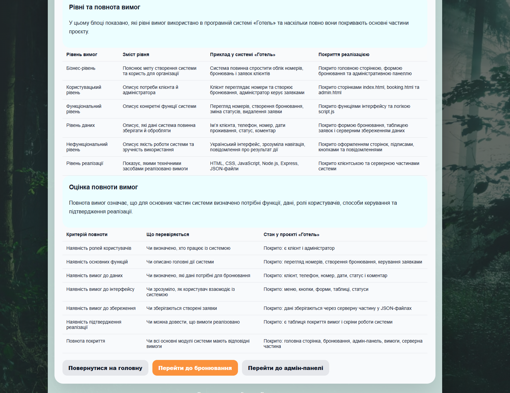

# Питання 6. Рівні та повнота вимог

## Питання

**Рівні та повнота вимог.**

## Відповідь

Рівні вимог показують, на якому рівні деталізації описано потреби до програмної системи. Одні вимоги пояснюють загальну мету створення системи, інші описують потреби користувачів, конкретні функції, дані, інтерфейс або технічну реалізацію.

Повнота вимог означає, що для системи визначено всі основні потреби, функції, ролі користувачів, дані, способи керування та підтвердження реалізації. Якщо вимоги неповні, під час розроблення можуть виникати ситуації, коли певна частина системи не описана, не реалізована або її неможливо перевірити.

У проєкті **«Програмна система “Готель”»** вимоги розглядаються на кількох рівнях: бізнес-рівні, користувацькому рівні, функціональному рівні, рівні даних, нефункціональному рівні та рівні реалізації. Такий поділ дозволяє показати, що система розроблялася не лише як набір сторінок, а як структурований програмний продукт із визначеними цілями, користувачами, функціями та даними.

## Рівні вимог

У програмній системі **«Готель»** можна виділити такі рівні вимог:

| Рівень вимог            | Що описує                                                  | Приклад у системі «Готель»                                                   |
| ----------------------- | ---------------------------------------------------------- | ---------------------------------------------------------------------------- |
| Бізнес-рівень           | Загальну мету створення системи та користь для організації | Система повинна спростити облік номерів, бронювань і заявок клієнтів         |
| Користувацький рівень   | Потреби користувачів системи                               | Клієнт переглядає номери та створює бронювання, адміністратор керує заявками |
| Функціональний рівень   | Конкретні функції, які повинна виконувати система          | Перегляд номерів, створення бронювання, зміна статусів, видалення заявки     |
| Рівень даних            | Дані, які система повинна зберігати й обробляти            | Ім’я клієнта, телефон, номер, дати проживання, статус і коментар             |
| Нефункціональний рівень | Якість роботи системи та зручність використання            | Український інтерфейс, зрозуміла навігація, повідомлення про результат дії   |
| Рівень реалізації       | Технічні засоби, за допомогою яких реалізовано вимоги      | HTML, CSS, JavaScript, Node.js, Express, JSON-файли                          |

Такий поділ допомагає краще зрозуміти, як загальна ідея системи переходить у конкретну реалізацію. Спочатку визначається мета системи, потім потреби користувачів, після цього — функції, дані, інтерфейс і технічні засоби реалізації.

## Реалізація рівнів вимог у проєкті «Готель»

У проєкті **«Програмна система “Готель”»** бізнес-рівень вимог проявляється в тому, що система створена для спрощення роботи з готельними бронюваннями. Замість ручного обліку заявок користувач може працювати з вебінтерфейсом, створювати бронювання та переглядати їх у адміністративній панелі.

Користувацький рівень вимог реалізовано через два основні сценарії роботи. Перший сценарій — клієнт переглядає номери, обирає потрібний варіант і створює бронювання. Другий сценарій — адміністратор переглядає заявки, змінює їх статус, підтверджує бронювання, заселяє клієнта, скасовує або видаляє заявку.

Функціональний рівень вимог реалізовано через конкретні функції системи: відображення номерів, створення бронювання, перевірку обов’язкових полів, збереження заявки, відображення таблиці бронювань і керування статусами.

Рівень даних реалізовано через форму бронювання та таблицю заявок. Система працює з такими даними: ім’я клієнта, телефон, дата заїзду, дата виїзду, номер, статус бронювання та коментар. Після додавання серверної частини дані зберігаються через сервер у JSON-файлах.

Нефункціональний рівень вимог реалізовано через український інтерфейс, зрозумілі підписи, кнопки, повідомлення про результат дії та єдине оформлення сторінок. Це робить систему зручною для користувача.

Рівень реалізації показує, якими технологіями виконано систему. Клієнтська частина використовує HTML, CSS і JavaScript, а серверна частина реалізована на Node.js + Express. Для збереження даних використовуються JSON-файли.

## Повнота вимог

Повнота вимог означає, що вимоги повинні охоплювати всі основні частини системи. Для проєкту **«Готель»** це означає, що потрібно визначити:

| Критерій повноти         | Що перевіряється                                       |
| ------------------------ | ------------------------------------------------------ |
| Ролі користувачів        | Чи зрозуміло, хто працює із системою                   |
| Основні функції          | Чи описано головні дії системи                         |
| Дані                     | Чи визначено, які дані потрібні для бронювання         |
| Інтерфейс                | Чи зрозуміло, як користувач взаємодіє із системою      |
| Збереження               | Чи зберігаються створені заявки                        |
| Підтвердження реалізації | Чи можна довести, що вимоги реалізовано                |
| Покриття модулів         | Чи всі основні частини системи мають відповідні вимоги |

У системі **«Готель»** ці критерії повноти виконані. Є визначені ролі користувачів: клієнт і адміністратор. Є основні функції: перегляд номерів, створення бронювання, керування заявками. Є вимоги до даних: клієнт, телефон, номер, дати, статус і коментар. Є вимоги до інтерфейсу: меню, кнопки, форми, таблиці та статуси. Є збереження даних через серверну частину. Також є підтвердження реалізації через сторінку покриття вимог і скріни роботи системи.

## Оцінка повноти вимог у системі «Готель»

| Критерій повноти                   | Стан у проєкті «Готель»                                                       |
| ---------------------------------- | ----------------------------------------------------------------------------- |
| Наявність ролей користувачів       | Покрито: є клієнт і адміністратор                                             |
| Наявність основних функцій         | Покрито: перегляд номерів, створення бронювання, керування заявками           |
| Наявність вимог до даних           | Покрито: клієнт, телефон, номер, дати, статус і коментар                      |
| Наявність вимог до інтерфейсу      | Покрито: меню, кнопки, форми, таблиці, статуси                                |
| Наявність вимог до збереження      | Покрито: дані зберігаються через серверну частину у JSON-файлах               |
| Наявність підтвердження реалізації | Покрито: є таблиця покриття вимог і скріни роботи системи                     |
| Повнота покриття основних модулів  | Покрито: головна сторінка, бронювання, адмін-панель, вимоги, серверна частина |

Таким чином, вимоги до системи можна вважати достатньо повними для навчального проєкту. Вони охоплюють основні ролі, функції, дані, інтерфейс, збереження та перевірку реалізації.

## Підтвердження реалізації

Для цього питання використовується один основний доказ — скрін сторінки **«Вимоги»**, де безпосередньо показано блок **«Рівні та повнота вимог»** і таблицю **«Оцінка повноти вимог»**.

### Рисунок 1 — Рівні та повнота вимог у програмній системі «Готель»

На рисунку показано, що в системі визначено кілька рівнів вимог: бізнес-рівень, користувацький рівень, функціональний рівень, рівень даних, нефункціональний рівень і рівень реалізації. Для кожного рівня наведено зміст, приклад у системі **«Готель»** і покриття реалізацією.

Також на рисунку показано оцінку повноти вимог. У таблиці перевіряється наявність ролей користувачів, основних функцій, вимог до даних, вимог до інтерфейсу, вимог до збереження, підтвердження реалізації та повноти покриття основних модулів системи.

Цей скрін прямо підтверджує відповідь на питання, тому що саме він показує рівні вимог і перевірку їх повноти в реалізованій програмній системі.

## Висновок

Отже, рівні вимог дозволяють розділити вимоги до системи за ступенем деталізації: від загальної мети створення системи до конкретних функцій, даних, інтерфейсу та технічної реалізації.

У проєкті **«Програмна система “Готель”»** вимоги охоплюють бізнес-рівень, користувацький рівень, функціональний рівень, рівень даних, нефункціональний рівень і рівень реалізації. Це дає змогу показати повний зв’язок між ідеєю системи, потребами користувачів, функціями програми та технічною реалізацією.

Повнота вимог у системі підтверджується тим, що визначено ролі користувачів, основні функції, необхідні дані, елементи інтерфейсу, спосіб збереження інформації та докази реалізації. Отже, вимоги до програмної системи **«Готель»** є достатньо повними для навчального проєкту та можуть бути використані для перевірки відповідності реалізованої програми поставленим завданням.
