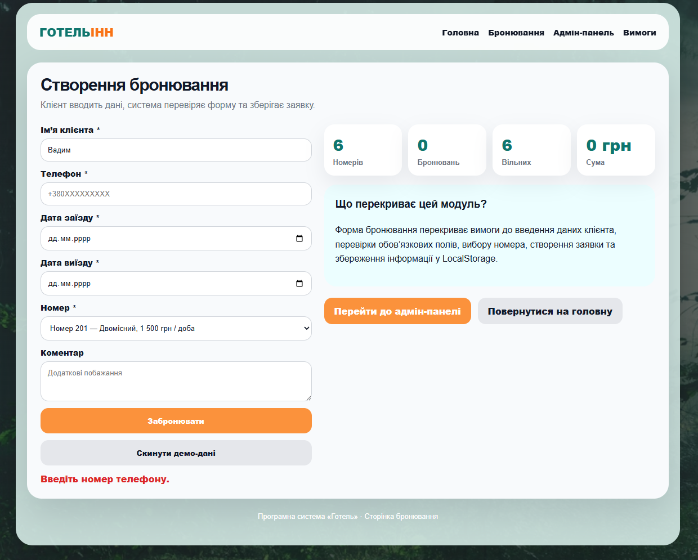
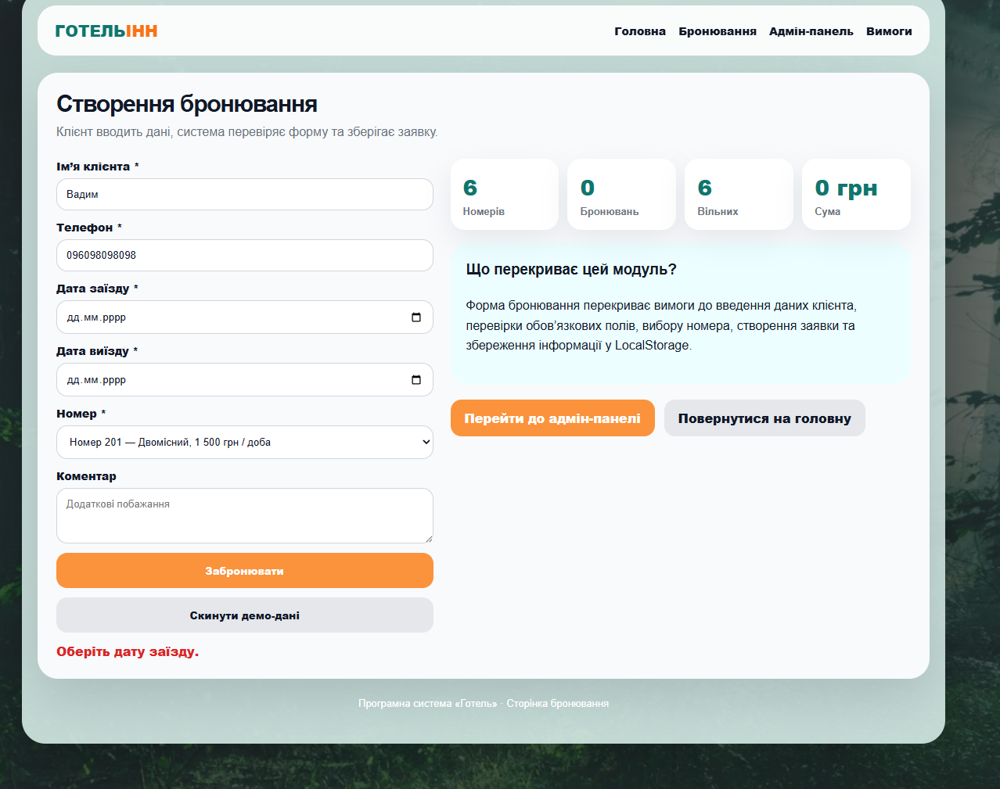

# Питання 7. Ясність вимог: недвозначність, визначеність, однозначність специфікацій

## Питання

**Ясність вимог: недвозначність, визначеність, однозначність специфікацій.**

## Відповідь

Ясність вимог означає, що вимога повинна бути сформульована так, щоб її однаково розуміли розробник, користувач, замовник і викладач. Якщо вимога нечітка, її можна трактувати по-різному, а це призводить до помилок у реалізації програмної системи.

Недвозначність вимоги означає, що вона не повинна мати кілька різних тлумачень. Вимога має описувати конкретну дію, конкретний об’єкт і конкретний очікуваний результат.

Визначеність вимоги означає, що в ній мають бути чітко вказані необхідні дані, умови виконання та результат. Наприклад, для бронювання недостатньо написати: “користувач бронює номер”. Потрібно визначити, які саме дані він вводить: ім’я, телефон, дату заїзду, дату виїзду та номер.

Однозначність специфікації означає, що опис вимоги повинен відповідати одному конкретному сценарію реалізації. Тобто за вимогою має бути зрозуміло, як саме вона реалізується в програмі та як її можна перевірити.

У проєкті **«Програмна система “Готель”»** ясність вимог показана через форму створення бронювання. Форма містить конкретні поля: **ім’я клієнта**, **телефон**, **дата заїзду**, **дата виїзду**, **номер** і **коментар**. Обов’язкові поля позначені символом `*`, тому користувач одразу бачить, які дані потрібно ввести для створення заявки.

## Реалізація в програмній системі «Готель»

У системі **«Готель»** ясність і однозначність вимог реалізовані через перевірку форми бронювання. Програма не дозволяє створити заявку з неповними або неправильними даними.

Якщо користувач не заповнив обов’язкове поле, система не показує загальне повідомлення типу “помилка”, а виводить конкретне пояснення. Наприклад, якщо не введено телефон, система показує повідомлення:

**«Введіть номер телефону.»**

Це повідомлення є ясним і однозначним, тому що користувач точно розуміє, яке поле потрібно заповнити.

Якщо користувач не обрав дату заїзду, система також показує конкретне повідомлення:

**«Оберіть дату заїзду.»**

Це підтверджує визначеність специфікації: система не просто відхиляє дію, а пояснює, яка саме умова не виконана.

У проєкті вимога до створення бронювання сформульована не абстрактно, а через конкретний набір даних. Для створення заявки користувач повинен ввести ім’я, телефон, дату заїзду, дату виїзду та обрати номер. Після цього система може створити бронювання і зберегти його.

## Приклади ясності вимог у системі

| Елемент системи                    | Як забезпечує ясність вимог                                                        |
| ---------------------------------- | ---------------------------------------------------------------------------------- |
| Поле «Ім’я клієнта *»              | Показує, що потрібно ввести ім’я клієнта і що поле є обов’язковим                  |
| Поле «Телефон *»                   | Чітко визначає, що потрібно ввести контактний номер                                |
| Поле «Дата заїзду *»               | Однозначно вказує на початок періоду проживання                                    |
| Поле «Дата виїзду *»               | Однозначно вказує на завершення періоду проживання                                 |
| Поле «Номер *»                     | Не дозволяє вводити довільний текст, а пропонує вибрати конкретний номер зі списку |
| Повідомлення про помилку           | Пояснює, яке саме поле потрібно виправити                                          |
| Повідомлення про успішне створення | Однозначно підтверджує результат дії користувача                                   |

## Недвозначність вимог

Недвозначність у системі **«Готель»** проявляється в тому, що кожна дія має конкретний зміст. Кнопка **«Забронювати»** означає створення нової заявки на бронювання. Поле **«Телефон»** означає введення номера телефону клієнта, а не будь-якого іншого контакту. Поле **«Дата заїзду»** означає початок проживання, а поле **«Дата виїзду»** — його завершення.

Завдяки цьому користувач не має кількох варіантів трактування однієї дії. Інтерфейс прямо підказує, які дані потрібно ввести і що відбудеться після натискання кнопки.

## Визначеність вимог

Визначеність вимог у проєкті забезпечується тим, що для бронювання визначено конкретний набір обов’язкових даних. Система не створює заявку, якщо відсутнє ім’я клієнта, телефон, дата заїзду, дата виїзду або номер.

Це означає, що вимога до створення бронювання є повною й визначеною. Вона не обмежується загальним формулюванням “створити бронювання”, а містить конкретні умови: користувач повинен заповнити обов’язкові поля, після чого система створює заявку.

## Однозначність специфікацій

Однозначність специфікацій підтверджується тим, що кожна помилка у формі має конкретне повідомлення. Якщо не введено телефон, система повідомляє саме про телефон. Якщо не вибрано дату заїзду, система повідомляє саме про дату заїзду.

Це дозволяє перевірити вимоги через роботу інтерфейсу. Тобто вимога не є лише текстовим описом — її можна перевірити практично: залишити поле порожнім, натиснути кнопку **«Забронювати»** і побачити конкретне повідомлення системи.

## Підтвердження реалізації

Для цього питання використовуються два скріни сторінки бронювання, які безпосередньо підтверджують ясність, визначеність і однозначність вимог.

### Рисунок 1 — Перевірка обов’язкового поля «Телефон»

На рисунку показано, що система не дозволяє створити бронювання без номера телефону. Повідомлення **«Введіть номер телефону.»** є конкретним і зрозумілим. Воно не має подвійного трактування й одразу пояснює користувачу, що потрібно виправити.

Цей скрін підтверджує недвозначність і визначеність вимоги: для створення бронювання телефон є обов’язковим полем.

### Рисунок 2 — Перевірка обов’язкового поля «Дата заїзду»

На рисунку показано, що система не дозволяє створити бронювання без дати заїзду. Повідомлення **«Оберіть дату заїзду.»** точно вказує, яке поле потрібно заповнити.

Цей скрін підтверджує однозначність специфікації: система перевіряє конкретну умову й показує конкретне повідомлення, а не загальну помилку.

## Висновок

Отже, ясність вимог у програмній системі **«Готель»** забезпечується через зрозумілі назви полів, позначення обов’язкових даних, конкретні повідомлення про помилки та однозначний результат дій користувача.

Недвозначність проявляється в тому, що кожна дія й кожне поле мають чітке призначення. Визначеність забезпечується тим, що для створення бронювання задано конкретний набір обов’язкових даних. Однозначність специфікацій підтверджується тим, що система перевіряє кожну умову окремо й повідомляє користувачу, що саме потрібно виправити.

Таким чином, вимоги до форми бронювання в системі **«Готель»** є ясними, визначеними та такими, що можуть бути перевірені через реальну роботу програми.
