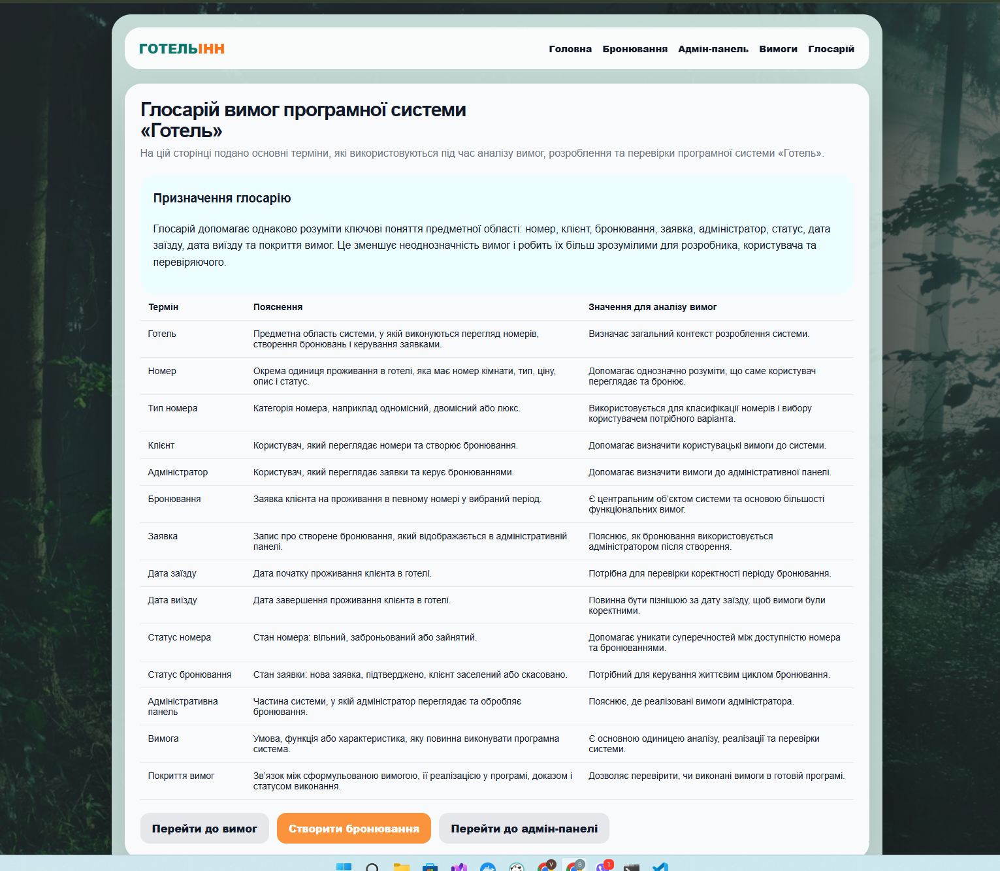

# Питання 19. Джерела вимог

## Питання

**Джерела вимог.**

## Відповідь

Джерела вимог — це інформаційні основи, з яких отримують вимоги до програмної системи. Вимоги не виникають випадково. Вони формуються на основі навчального завдання, предметної області, потреб користувачів, бізнес-процесів, правил роботи системи та результатів аналізу.

Для програмної системи важливо правильно визначити джерела вимог, тому що саме вони пояснюють, чому в системі повинні бути певні функції, дані, сторінки, ролі користувачів і способи перевірки.

У проєкті **«Програмна система “Готель”»** основними джерелами вимог є предметна область готелю, потреби клієнта, потреби адміністратора, навчальне завдання, аналіз проблемної області та результати перевірки реалізації.

## Основні джерела вимог у проєкті «Готель»

| Джерело вимог            | Що дає для системи                                         | Приклад у проєкті «Готель»                                           |
| ------------------------ | ---------------------------------------------------------- | -------------------------------------------------------------------- |
| Навчальне завдання       | Визначає загальну тему, мету й очікуваний результат роботи | Потрібно створити програмну систему для обраної предметної області   |
| Предметна область        | Дає основні поняття, об’єкти й правила роботи              | Готель, номер, клієнт, бронювання, заявка, статус                    |
| Потреби клієнта          | Визначають користувацькі вимоги                            | Клієнт повинен переглядати номери й створювати бронювання            |
| Потреби адміністратора   | Визначають вимоги до керування системою                    | Адміністратор повинен бачити заявки, статуси й керувати бронюваннями |
| Бізнес-процес бронювання | Пояснює послідовність роботи системи                       | Перегляд номера → створення заявки → обробка адміністратором         |
| Дані предметної області  | Визначають, які дані потрібно зберігати                    | Ім’я клієнта, телефон, номер, дати проживання, статус, коментар      |
| Перевірка реалізації     | Допомагає уточнити, чи вимоги виконані                     | Таблиця покриття вимог реалізацією та скріни роботи системи          |

## Реалізація в програмній системі «Готель»

У системі **«Готель»** джерела вимог проявляються через реальні частини програми.

Предметна область готелю є одним із головних джерел вимог. Саме з неї взято основні поняття: номер, тип номера, клієнт, бронювання, заявка, статус номера, статус бронювання, дата заїзду та дата виїзду. Ці терміни зафіксовані в окремій вкладці **«Глосарій»**, щоб усі учасники проєкту однаково їх розуміли.

Потреби клієнта стали джерелом вимог до перегляду номерів і створення бронювання. Клієнт повинен мати можливість побачити доступні номери, обрати потрібний варіант, ввести свої дані й створити заявку.

Потреби адміністратора стали джерелом вимог до адміністративної панелі. Адміністратор повинен бачити створені заявки, дані клієнта, номер, період проживання, статус і кнопки керування. Без цих вимог система не була б придатною для подальшої роботи з бронюваннями.

Бізнес-процес бронювання також є джерелом вимог. У системі він виглядає так: користувач обирає номер, створює бронювання, система зберігає заявку, а адміністратор переглядає її в адміністративній панелі та виконує подальші дії.

Окремим джерелом уточнення вимог є перевірка реалізації. Сторінка **«Покриття вимог реалізацією»** показує, які вимоги були сформовані, як вони реалізовані в програмі, яким доказом підтверджуються і який мають статус.

## Приклади джерел вимог у системі

| Вимога                                     | Джерело вимоги                      | Пояснення                                                            |
| ------------------------------------------ | ----------------------------------- | -------------------------------------------------------------------- |
| Система повинна відображати список номерів | Предметна область і потреби клієнта | Клієнт повинен бачити, які номери доступні                           |
| Клієнт повинен створювати бронювання       | Потреби клієнта та бізнес-процес    | Основна дія користувача в системі                                    |
| Система повинна перевіряти дати            | Правила предметної області          | Дата виїзду повинна бути пізнішою за дату заїзду                     |
| Адміністратор повинен бачити заявки        | Потреби адміністратора              | Без цього неможливо обробляти бронювання                             |
| Бронювання повинно мати статус             | Бізнес-процес і експлуатація        | Потрібно розуміти поточний стан заявки                               |
| Бронювання повинно містити дані клієнта    | Дані предметної області             | Для обробки заявки потрібні ім’я, телефон, номер і період проживання |
| Вимоги повинні мати докази реалізації      | Навчальне завдання та перевірка     | Викладач або перевіряючий має бачити, що вимоги виконані             |

## Підтвердження реалізації

Для цього питання використовуються три докази, тому що вони показують різні джерела вимог: предметну область, сформовані вимоги та реальний експлуатаційний сценарій.

### Рисунок 1 — Предметна область як джерело вимог

На рисунку показано сторінку **«Глосарій»**, де визначено основні терміни предметної області: готель, номер, тип номера, клієнт, адміністратор, бронювання, заявка, дата заїзду, дата виїзду, статус номера, статус бронювання, вимога та покриття вимог.

Цей скрін підтверджує, що предметна область є джерелом вимог. Саме з понять готельної сфери формуються вимоги до даних, інтерфейсу, статусів і сценаріїв роботи системи.

### Рисунок 2 — Сформовані вимоги та їх зв’язок із реалізацією

На рисунку показано таблицю покриття вимог реалізацією. У ній видно ID вимоги, формулювання, реалізацію в програмі, доказ для скріну та статус виконання.

Цей скрін підтверджує, що джерела вимог були опрацьовані та перетворені на конкретні вимоги до системи. Вимоги не залишилися загальними ідеями, а були сформульовані, пов’язані з реалізацією та підготовлені до перевірки.

### Рисунок 3 — Експлуатаційний сценарій як джерело практичних вимог

На рисунку показано адміністративну панель після створення бронювання. У таблиці видно клієнта, телефон, номер, період проживання, статус заявки, кнопки керування та статистичні показники.

Цей скрін підтверджує, що джерелом вимог є не лише теоретичний опис, а й реальна потреба експлуатації системи. Адміністратору потрібно бачити заявку, перевіряти її дані, контролювати статус і керувати бронюванням.

## Висновок

Отже, джерела вимог у проєкті **«Програмна система “Готель”»** пов’язані з навчальним завданням, предметною областю, потребами клієнта, потребами адміністратора, бізнес-процесом бронювання, даними системи та перевіркою реалізації.

Предметна область дала основні поняття системи, потреби користувачів визначили функції, бізнес-процес пояснив послідовність роботи, а таблиця покриття вимог дозволила пов’язати сформульовані вимоги з готовою програмою.

Таким чином, вимоги в системі **«Готель»** мають зрозумілі джерела та не є випадковими. Вони сформовані на основі реальної логіки роботи готелю, потреб користувачів і результатів аналізу програмної системи.
