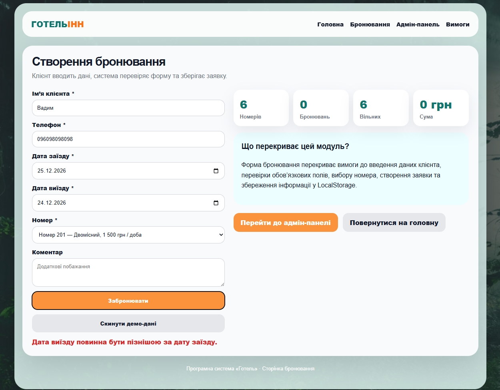

# Питання 25. Специфікація варіанту використання. Табличні представлення варіанту використання

## Питання

**Специфікація варіанту використання. Табличні представлення варіанту використання.**

## Відповідь

Табличне представлення варіанту використання — це спосіб опису сценарію взаємодії користувача із системою у вигляді структурованих таблиць. Такий підхід дозволяє чітко показати актора, мету, передумови, основний сценарій, альтернативні сценарії, постумови, дані та зв’язок із вимогами.

На відміну від звичайного текстового опису, табличне представлення робить варіант використання більш зручним для аналізу, реалізації та перевірки. У таблиці легко побачити, хто виконує дію, що робить система, які умови повинні бути виконані та який результат очікується після завершення сценарію.

У проєкті **«Програмна система “Готель”»** для табличного представлення обрано основний варіант використання **«Створення бронювання»**, тому що він є центральним сценарієм роботи системи.

## Загальна таблиця варіанту використання

| Поле                     | Опис                                                                          |
| ------------------------ | ----------------------------------------------------------------------------- |
| ID варіанту використання | UC-01                                                                         |
| Назва                    | Створення бронювання                                                          |
| Основний актор           | Клієнт                                                                        |
| Допоміжний актор         | Адміністратор                                                                 |
| Мета                     | Створити заявку на бронювання номера в готелі                                 |
| Передумови               | Система запущена, сторінка бронювання доступна, у системі є номери для вибору |
| Тригер                   | Клієнт переходить на сторінку бронювання та заповнює форму                    |
| Основний результат       | Бронювання створене, збережене й доступне адміністратору                      |
| Пріоритет                | Високий                                                                       |
| Частота використання     | Часто, оскільки це основний сценарій системи                                  |

## Табличне представлення основного сценарію

| Крок | Дія користувача                             | Реакція системи                                | Результат                           |
| ---- | ------------------------------------------- | ---------------------------------------------- | ----------------------------------- |
| 1    | Клієнт відкриває сторінку бронювання        | Система показує форму створення бронювання     | Користувач бачить поля введення     |
| 2    | Клієнт вводить ім’я                         | Система приймає текстові дані                  | Ім’я додано до майбутньої заявки    |
| 3    | Клієнт вводить телефон                      | Система приймає контактні дані                 | Телефон додано до заявки            |
| 4    | Клієнт обирає дату заїзду                   | Система фіксує початок проживання              | Дата заїзду збережена у формі       |
| 5    | Клієнт обирає дату виїзду                   | Система перевіряє логіку дат                   | Період проживання стає визначеним   |
| 6    | Клієнт обирає номер                         | Система прив’язує заявку до конкретного номера | Вибраний номер додано до бронювання |
| 7    | Клієнт вводить коментар                     | Система додає коментар до заявки               | Додаткові побажання збережені       |
| 8    | Клієнт натискає кнопку створення бронювання | Система перевіряє обов’язкові поля             | Починається створення заявки        |
| 9    | Дані введені правильно                      | Система створює бронювання                     | Заявка зберігається                 |
| 10   | Клієнт бачить повідомлення про успіх        | Система підтверджує створення бронювання       | Користувач розуміє, що дія виконана |
| 11   | Адміністратор відкриває адмін-панель        | Система показує створену заявку                | Бронювання доступне для обробки     |

## Табличне представлення альтернативного сценарію

| Альтернативний сценарій            | Умова виникнення                              | Реакція системи                                                                      | Результат                        |
| ---------------------------------- | --------------------------------------------- | ------------------------------------------------------------------------------------ | -------------------------------- |
| A1. Не введено ім’я                | Користувач залишив поле імені порожнім        | Система показує повідомлення про необхідність ввести ім’я                            | Бронювання не створюється        |
| A2. Не введено телефон             | Користувач залишив поле телефону порожнім     | Система показує повідомлення **«Введіть номер телефону.»**                           | Бронювання не створюється        |
| A3. Не обрано дату заїзду          | Користувач не вибрав дату початку проживання  | Система показує повідомлення **«Оберіть дату заїзду.»**                              | Бронювання не створюється        |
| A4. Дата виїзду раніше дати заїзду | Користувач ввів некоректний період проживання | Система показує повідомлення **«Дата виїзду повинна бути пізнішою за дату заїзду.»** | Некоректна заявка не створюється |
| A5. Не обрано номер                | Користувач не вибрав номер зі списку          | Система просить обрати номер                                                         | Бронювання не створюється        |

## Табличне представлення даних варіанту використання

| Дані         | Джерело               | Призначення                            |
| ------------ | --------------------- | -------------------------------------- |
| Ім’я клієнта | Поле форми бронювання | Ідентифікація клієнта                  |
| Телефон      | Поле форми бронювання | Контакт для зв’язку                    |
| Дата заїзду  | Поле дати             | Визначення початку проживання          |
| Дата виїзду  | Поле дати             | Визначення завершення проживання       |
| Номер        | Список вибору         | Прив’язка заявки до конкретного номера |
| Коментар     | Текстове поле         | Додаткові побажання клієнта            |
| Статус       | Створюється системою  | Показує стан заявки                    |
| Сума         | Обчислюється системою | Показує вартість бронювання            |

## Табличне представлення постумов

| Постумова                   | Як підтверджується в системі                                                         |
| --------------------------- | ------------------------------------------------------------------------------------ |
| Бронювання створено         | Після натискання кнопки система показує повідомлення про успішне створення           |
| Дані збережено              | Заявка з’являється в адміністративній панелі                                         |
| Адміністратор бачить заявку | У таблиці адмін-панелі відображаються клієнт, телефон, номер, період і статус        |
| Статистика оновлена         | У верхніх блоках адмін-панелі змінюється кількість бронювань, вільних номерів і сума |
| Заявка має статус           | Нове бронювання отримує статус **«Нова заявка»**                                     |

## Зв’язок табличного представлення з вимогами

| Вимога                                                | Як відображена в таблицях варіанту використання |
| ----------------------------------------------------- | ----------------------------------------------- |
| Клієнт повинен створювати бронювання                  | Описано в основному сценарії                    |
| Система повинна перевіряти обов’язкові поля           | Описано в альтернативних сценаріях              |
| Дата виїзду повинна бути пізнішою за дату заїзду      | Описано в альтернативному сценарії A4           |
| Система повинна зберігати бронювання                  | Описано в постумовах                            |
| Адміністратор повинен бачити заявки                   | Описано в основному сценарії та постумовах      |
| Бронювання повинно містити дані клієнта, номер і дати | Описано в таблиці даних                         |
| Заявка повинна мати статус                            | Описано в постумовах                            |

## Реалізація в програмній системі «Готель»

У програмній системі **«Готель»** табличне представлення варіанту використання відповідає реальній роботі програми.

Основний сценарій реалізовано через сторінку бронювання. Клієнт вводить дані, обирає номер і створює заявку. Після успішного виконання система показує повідомлення про створення та збереження бронювання.

Альтернативний сценарій реалізовано через перевірку введених даних. Якщо користувач вводить неправильний період проживання, система не створює заявку й показує конкретне повідомлення про помилку.

Постумови підтверджуються адміністративною панеллю. Після створення бронювання адміністратор бачить заявку в таблиці, а система оновлює статистику.

## Підтвердження реалізації

Для цього питання використовуються три докази, які відповідають табличному опису варіанту використання: основний сценарій, альтернативний сценарій і постумови.

### Рисунок 1 — Основний сценарій створення бронювання

На рисунку показано успішне створення бронювання. Користувач заповнив форму, система прийняла дані та показала повідомлення **«Бронювання успішно створено та збережено.»**

Цей скрін підтверджує основний сценарій табличного представлення варіанту використання.

### Рисунок 2 — Альтернативний сценарій із некоректними датами

На рисунку показано альтернативний сценарій. Користувач ввів дату виїзду, яка є ранішою за дату заїзду. Система не створила бронювання та показала повідомлення **«Дата виїзду повинна бути пізнішою за дату заїзду.»**

Цей скрін підтверджує, що табличне представлення враховує не лише успішний сценарій, а й помилкові ситуації.

### Рисунок 3 — Постумови після створення бронювання

На рисунку показано адміністративну панель після створення бронювання. У таблиці видно заявку клієнта, телефон, номер, період проживання, статус **«Нова заявка»** і кнопки керування. Також видно кількісні показники системи.

Цей скрін підтверджує постумови варіанту використання: бронювання збережене, доступне адміністратору та враховане в статистиці системи.

## Висновок

Отже, табличне представлення варіанту використання дозволяє структуровано описати сценарій роботи користувача із системою. Воно показує основний сценарій, альтернативні ситуації, дані, постумови та зв’язок із вимогами.

У проєкті **«Програмна система “Готель”»** табличне представлення варіанту використання **«Створення бронювання»** допомагає чітко описати, як клієнт створює заявку, як система перевіряє дані та як результат відображається в адміністративній панелі.

Таким чином, табличне представлення робить специфікацію варіанту використання зрозумілою, перевірюваною та зручною для подальшої реалізації й аналізу.
