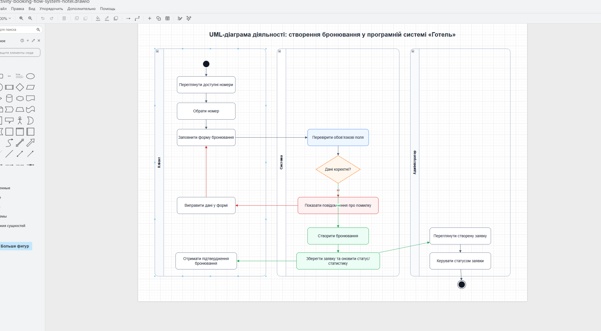
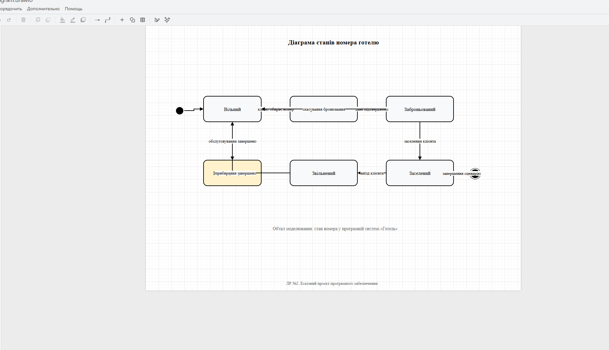

# Питання 29. Моделі UML, що пояснюють функціональність системи

## Питання

**Моделі UML, що пояснюють функціональність системи.**

## Відповідь

UML-моделі використовуються для наочного пояснення функціональності програмної системи. Вони допомагають показати, які користувачі взаємодіють із системою, які функції їм доступні, як виконується основний робочий процес і як змінюються стани важливих об’єктів системи.

У проєкті **«Програмна система “Готель”»** UML-моделі потрібні для того, щоб пояснити функціональність не тільки через текст або скріни інтерфейсу, а й через формальні моделі програмної інженерії.

Для пояснення функціональності системи використано три UML-моделі:

| UML-модель                      | Що пояснює                                                        |
| ------------------------------- | ----------------------------------------------------------------- |
| Діаграма варіантів використання | Показує акторів системи та функції, які вони виконують            |
| Діаграма дій                    | Показує послідовність виконання основного сценарію бронювання     |
| Діаграма станів                 | Показує зміну станів номера або бронювання під час роботи системи |

Ці три діаграми доповнюють одна одну. Діаграма варіантів використання показує, **хто** працює із системою і **які функції** доступні кожному актору. Діаграма дій показує, **як саме** виконується головний процес системи — створення бронювання. Діаграма станів показує, **як змінюється стан номера або заявки** після дій клієнта й адміністратора.

## UML-діаграма варіантів використання

Діаграма варіантів використання пояснює функціональність системи через акторів і сценарії взаємодії з програмою.

У системі **«Готель»** основними акторами є:

| Актор         | Роль у системі                                                 |
| ------------- | -------------------------------------------------------------- |
| Клієнт        | Переглядає номери, обирає номер і створює бронювання           |
| Адміністратор | Переглядає бронювання, керує заявками, додає та редагує номери |

Для актора **Клієнт** на діаграмі показано такі варіанти використання:

| Варіант використання              | Пояснення                                                    |
| --------------------------------- | ------------------------------------------------------------ |
| Переглянути доступні номери       | Клієнт бачить список номерів готелю                          |
| Переглянути інформацію про номер  | Клієнт переглядає тип, опис, ціну та статус номера           |
| Створити бронювання               | Клієнт заповнює форму й створює заявку                       |
| Перевірити доступність номера     | Система враховує доступність номера перед бронюванням        |
| Отримати підтвердження бронювання | Після успішної дії клієнт отримує повідомлення про результат |

Для актора **Адміністратор** на діаграмі показано такі варіанти використання:

| Варіант використання                 | Пояснення                                                          |
| ------------------------------------ | ------------------------------------------------------------------ |
| Переглянути список бронювань         | Адміністратор бачить створені заявки                               |
| Додати номер                         | Адміністратор додає новий номер у систему                          |
| Редагувати інформацію про номер      | Адміністратор змінює тип, ціну, опис, статус або зображення номера |
| Керувати статусом заявки             | Адміністратор змінює стан бронювання                               |
| Підтвердити або скасувати бронювання | Адміністратор приймає рішення щодо заявки                          |

Ця діаграма пояснює функціональність системи на рівні ролей користувачів. Вона показує, що клієнт працює з переглядом номерів і бронюванням, а адміністратор — з бронюваннями, статусами та номерним фондом.

## UML-діаграма дій

Діаграма дій пояснює функціональність системи через послідовність виконання процесу. Вона показує, як саме проходить основний сценарій створення бронювання.

У системі **«Готель»** основний процес починається з того, що клієнт переглядає доступні номери, обирає номер і заповнює форму бронювання. Після цього система перевіряє обов’язкові поля та коректність введених даних.

Якщо дані неправильні, система показує повідомлення про помилку, а клієнт повертається до форми й виправляє дані. Якщо дані правильні, система створює бронювання, зберігає заявку, оновлює статуси та статистику.

Після цього клієнт отримує підтвердження бронювання, а адміністратор бачить створену заявку в адміністративній панелі та може керувати її статусом.

## Основний процес на діаграмі дій

| Етап | Дія                                                            |
| ---- | -------------------------------------------------------------- |
| 1    | Клієнт переглядає доступні номери                              |
| 2    | Клієнт обирає номер                                            |
| 3    | Клієнт заповнює форму бронювання                               |
| 4    | Система перевіряє обов’язкові поля                             |
| 5    | Система перевіряє коректність даних                            |
| 6    | Якщо дані некоректні, система показує повідомлення про помилку |
| 7    | Клієнт виправляє дані у формі                                  |
| 8    | Якщо дані коректні, система створює бронювання                 |
| 9    | Система зберігає заявку та оновлює статуси / статистику        |
| 10   | Клієнт отримує підтвердження бронювання                        |
| 11   | Адміністратор переглядає створену заявку                       |
| 12   | Адміністратор керує статусом заявки                            |

Ця UML-модель пояснює функціональність системи через логіку виконання основного сценарію. Вона показує не тільки успішний шлях, а й альтернативну ситуацію, коли користувач вводить неправильні дані.

## UML-діаграма станів

Діаграма станів пояснює функціональність системи через зміну станів важливого об’єкта. У проєкті **«Програмна система “Готель”»** таким об’єктом є номер або пов’язане з ним бронювання.

Ця діаграма показує, як номер переходить з одного стану в інший залежно від дій клієнта, системи та адміністратора. Наприклад, спочатку номер може бути вільним. Після створення бронювання з’являється нова заявка. Після підтвердження бронювання номер переходить у стан заброньованого. Після заселення клієнта номер стає зайнятим або заселеним. Після виїзду клієнта номер може бути звільнений, підготовлений і знову повернутий у стан вільного.

## Основні стани номера або бронювання

| Стан                 | Пояснення                                                       |
| -------------------- | --------------------------------------------------------------- |
| Вільний              | Номер доступний для бронювання                                  |
| Нова заявка          | Клієнт створив бронювання, але адміністратор ще його не обробив |
| Заброньований        | Бронювання підтверджене або номер закріплений за заявкою        |
| Заселений / зайнятий | Клієнт заселений, номер використовується                        |
| Звільнений           | Клієнт виїхав, номер більше не зайнятий                         |
| Підготовка номера    | Номер готується до нового використання                          |
| Скасовано            | Бронювання скасоване, номер може повернутися до доступних       |
| Видалено             | Заявку прибрано із системи                                      |

## Переходи між станами

| Перехід                        | Що його викликає                            |
| ------------------------------ | ------------------------------------------- |
| Вільний → Нова заявка          | Клієнт створює бронювання                   |
| Нова заявка → Заброньований    | Адміністратор підтверджує бронювання        |
| Нова заявка → Вільний          | Адміністратор скасовує заявку               |
| Заброньований → Заселений      | Адміністратор заселяє клієнта               |
| Заселений → Звільнений         | Клієнт завершує проживання                  |
| Звільнений → Підготовка номера | Номер потребує підготовки після виїзду      |
| Підготовка номера → Вільний    | Підготовку завершено, номер знову доступний |

Діаграма станів важлива для пояснення функціональності системи, тому що вона показує життєвий цикл номера. Завдяки їй можна перевірити, чи не виникає суперечливих станів, наприклад коли номер одночасно вважається вільним і зайнятим.

## Реалізація UML-моделей у проєкті «Готель»

У проєкті **«Програмна система “Готель”»** UML-моделі відповідають реальній роботі програми.

Діаграма варіантів використання пов’язана з основними сторінками системи. Варіанти використання клієнта реалізовані через головну сторінку та сторінку бронювання. Варіанти використання адміністратора реалізовані через адміністративну панель і сторінку керування номерами.

Діаграма дій пов’язана з основним процесом створення бронювання. Вона показує, як клієнт переходить від перегляду номерів до створення заявки, як система перевіряє дані, як обробляє помилки та як після успішного створення бронювання адміністратор отримує заявку для подальшої роботи.

Діаграма станів пов’язана зі статусами номера та бронювання. Вона пояснює, як змінюється стан об’єкта після створення заявки, підтвердження бронювання, заселення клієнта, виїзду, скасування або повернення номера до доступних.

Таким чином, UML-моделі не є окремими абстрактними схемами. Вони пояснюють реальні функції, процеси й стани, які вже реалізовані в програмній системі **«Готель»**.

## Підтвердження реалізації

Для цього питання використовуються три UML-діаграми, тому що саме вони напряму пояснюють функціональність системи з різних боків.

### Рисунок 1 — UML-діаграма варіантів використання програмної системи «Готель»

На рисунку показано акторів **Клієнт** і **Адміністратор**, а також варіанти використання, які їм доступні.

Для клієнта діаграма показує перегляд доступних номерів, перегляд інформації про номер, створення бронювання, перевірку доступності номера та отримання підтвердження бронювання.

Для адміністратора діаграма показує перегляд списку бронювань, додавання номера, редагування інформації про номер, керування статусом заявки та підтвердження або скасування бронювання.

Ця UML-модель пояснює функціональність системи через ролі користувачів і доступні їм дії.

### Рисунок 2 — UML-діаграма дій створення бронювання

На рисунку показано послідовність виконання основного функціонального сценарію системи.

Клієнт переглядає доступні номери, обирає номер і заповнює форму бронювання. Система перевіряє обов’язкові поля та коректність даних. Якщо дані неправильні, система показує повідомлення про помилку, а клієнт виправляє дані у формі. Якщо дані правильні, система створює бронювання, зберігає заявку, оновлює статуси та статистику.

Після цього клієнт отримує підтвердження бронювання, а адміністратор переглядає створену заявку та керує її статусом.

Ця UML-модель пояснює функціональність системи через реальний процес роботи програми.

### Рисунок 3 — UML-діаграма станів номера в програмній системі «Готель»

На рисунку показано життєвий цикл номера в програмній системі **«Готель»**. Діаграма демонструє, що номер може переходити між станами **«Вільний»**, **«Нова заявка»**, **«Заброньований»**, **«Заселений»**, **«Звільнений»** і **«Підготовка номера»**.

Ця UML-модель пояснює функціональність системи через зміну станів номера або бронювання. Вона показує, що статуси в системі змінюються не випадково, а відповідно до дій клієнта, системи та адміністратора.

## Висновок

Отже, UML-моделі допомагають пояснити функціональність програмної системи **«Готель»** у наочній і структурованій формі.

Діаграма варіантів використання показує, які актори працюють із системою та які функції доступні клієнту й адміністратору. Діаграма дій показує, як виконується основний сценарій створення бронювання та як система реагує на правильні й неправильні дані. Діаграма станів показує, як змінюється стан номера або бронювання під час роботи системи.

Таким чином, UML-моделі пов’язують вимоги з реальною поведінкою програми та допомагають зрозуміти, як система **«Готель»** виконує свої основні функції.
