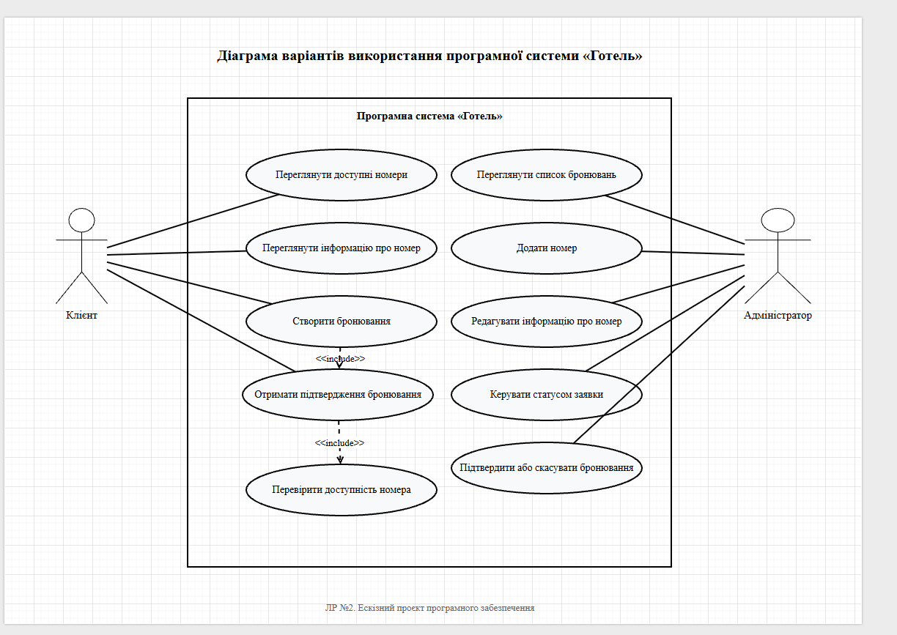

# Питання 30. Діаграма варіантів використання

## Питання

**Діаграма варіантів використання.**

## Відповідь

Діаграма варіантів використання — це UML-діаграма, яка показує, які актори взаємодіють із програмною системою та які функції вони можуть виконувати. Вона допомагає зрозуміти зовнішню поведінку системи без детального розгляду програмного коду.

Основна мета діаграми варіантів використання — показати:

* хто користується системою;
* які дії доступні кожному користувачу;
* які функції входять у межі системи;
* як актори пов’язані з основними сценаріями роботи.

У проєкті **«Програмна система “Готель”»** діаграма варіантів використання показує двох основних акторів: **Клієнт** і **Адміністратор**. Клієнт використовує систему для перегляду номерів і створення бронювання, а адміністратор — для роботи з бронюваннями, статусами заявок і номерним фондом.

## Основні елементи діаграми

У діаграмі варіантів використання для системи **«Готель»** є такі основні елементи:

| Елемент діаграми     | Значення в проєкті                                                                    |
| -------------------- | ------------------------------------------------------------------------------------- |
| Актор                | Роль користувача, який взаємодіє із системою                                          |
| Варіант використання | Функція або дія, яку актор виконує в системі                                          |
| Межа системи         | Прямокутник, який показує, які функції входять до складу програмної системи           |
| Зв’язок              | Лінія між актором і функцією, яка показує взаємодію                                   |
| `<<include>>`        | Включення одного сценарію в інший, якщо дія є обов’язковою частиною основного процесу |

## Актори системи

У програмній системі **«Готель»** визначено два основні актори.

| Актор         | Опис                                                                                                             |
| ------------- | ---------------------------------------------------------------------------------------------------------------- |
| Клієнт        | Користувач, який переглядає доступні номери, переглядає інформацію про номер і створює бронювання                |
| Адміністратор | Користувач, який переглядає список бронювань, керує статусами заявок, додає номери та редагує інформацію про них |

Клієнт і адміністратор розміщені поза межами системи, тому що вони не є частиною програми. Вони лише взаємодіють із нею через інтерфейс.

## Варіанти використання клієнта

Для актора **Клієнт** на діаграмі показано такі варіанти використання:

| Варіант використання              | Пояснення                                                                 |
| --------------------------------- | ------------------------------------------------------------------------- |
| Переглянути доступні номери       | Клієнт відкриває систему та бачить список номерів готелю                  |
| Переглянути інформацію про номер  | Клієнт бачить тип номера, опис, ціну та статус                            |
| Створити бронювання               | Клієнт заповнює форму бронювання та створює заявку                        |
| Перевірити доступність номера     | Система перевіряє, чи можна створити бронювання на вибраний номер         |
| Отримати підтвердження бронювання | Після успішного створення заявки клієнт бачить повідомлення про результат |

Головним варіантом використання для клієнта є **«Створити бронювання»**, тому що саме через нього система виконує основне призначення — створення заявки на проживання.

## Варіанти використання адміністратора

Для актора **Адміністратор** на діаграмі показано такі варіанти використання:

| Варіант використання                 | Пояснення                                                          |
| ------------------------------------ | ------------------------------------------------------------------ |
| Переглянути список бронювань         | Адміністратор бачить усі створені заявки                           |
| Додати номер                         | Адміністратор додає новий номер у систему                          |
| Редагувати інформацію про номер      | Адміністратор змінює тип, ціну, опис, статус або зображення номера |
| Керувати статусом заявки             | Адміністратор змінює стан заявки                                   |
| Підтвердити або скасувати бронювання | Адміністратор приймає рішення щодо створеної заявки                |

Ці варіанти використання показують, що адміністратор відповідає за керування робочою частиною системи: бронюваннями, статусами та номерним фондом.

## Межі системи

На діаграмі межа системи позначена прямокутником із назвою:

**«Програмна система “Готель”»**

Усі варіанти використання, які знаходяться всередині цього прямокутника, входять у межі поточної версії проєкту. Це означає, що система реально підтримує ці функції.

До меж системи входять:

| Частина функціональності          | Приклади варіантів використання                                                              |
| --------------------------------- | -------------------------------------------------------------------------------------------- |
| Робота клієнта з номерами         | Перегляд доступних номерів, перегляд інформації про номер                                    |
| Створення бронювання              | Створити бронювання, перевірити доступність номера, отримати підтвердження                   |
| Робота адміністратора із заявками | Переглянути список бронювань, керувати статусом заявки, підтвердити або скасувати бронювання |
| Керування номерним фондом         | Додати номер, редагувати інформацію про номер                                                |

Таким чином, діаграма чітко показує, що входить до складу системи, а що залишається поза її межами.

## Реалізація в програмній системі «Готель»

У готовій програмі варіанти використання з діаграми реалізовані через окремі сторінки та функції.

Клієнт працює з головною сторінкою та сторінкою бронювання. На головній сторінці він переглядає номери, їх типи, ціни, описи та статуси. На сторінці бронювання він вводить дані, обирає номер і створює заявку.

Адміністратор працює з адміністративною панеллю та сторінкою керування номерами. В адміністративній панелі він переглядає заявки, бачить статуси й може виконувати дії з бронюваннями. На сторінці керування номерами адміністратор може додати новий номер або змінити інформацію про вже наявний номер.

Отже, діаграма варіантів використання не є абстрактною схемою. Вона відповідає реальним сторінкам і функціям програмної системи **«Готель»**.

## Підтвердження реалізації

Для цього питання використовується один основний доказ — UML-діаграма варіантів використання програмної системи **«Готель»**.

### Рисунок 1 — Діаграма варіантів використання програмної системи «Готель»

На рисунку показано межі програмної системи **«Готель»**, акторів **Клієнт** і **Адміністратор**, а також варіанти використання, які доступні кожному з них.

Клієнт пов’язаний із переглядом доступних номерів, переглядом інформації про номер, створенням бронювання, перевіркою доступності номера та отриманням підтвердження бронювання.

Адміністратор пов’язаний із переглядом списку бронювань, додаванням номера, редагуванням інформації про номер, керуванням статусом заявки та підтвердженням або скасуванням бронювання.

Ця діаграма прямо підтверджує функціональні можливості системи та показує, які ролі взаємодіють із програмною системою **«Готель»**.

## Висновок

Отже, діаграма варіантів використання є важливою UML-моделлю, яка пояснює функціональність програмної системи через акторів і доступні їм сценарії роботи.

У проєкті **«Програмна система “Готель”»** діаграма показує двох основних акторів: клієнта та адміністратора. Клієнт виконує дії, пов’язані з переглядом номерів і створенням бронювання. Адміністратор виконує дії, пов’язані з переглядом заявок, керуванням статусами, додаванням і редагуванням номерів.

Таким чином, діаграма варіантів використання чітко показує межі системи, основних користувачів і функції, які реалізовані в програмній системі **«Готель»**.
