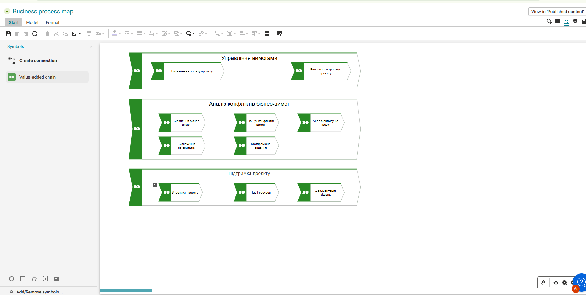

# Конфліктуючі бізнес-вимоги програмної системи «Готель»

Документ містить опис бізнес-вимог, що можуть конфліктувати між собою під час проєктування і програмування навчальної програмної системи «Готель».

## 1. Тема роботи

**Тема:** Визначення образу й границь проєкту.  
**Підтема:** Бізнес-вимоги, що конфліктують між собою.

## 2. Мета роботи

Метою роботи є визначення образу й границь програмної системи «Готель», а також аналіз бізнес-вимог, які можуть суперечити одна одній у процесі проєктування та реалізації системи.

## 3. Короткий опис проєкту

Програмна система «Готель» призначена для автоматизації базових процесів роботи готелю.

Основні функції системи:

- перегляд номерів;
- пошук і фільтрація номерів;
- бронювання номера;
- скасування бронювання;
- зміна статусу номера;
- перегляд статистики готелю;
- збереження даних про бронювання.

## 4. Образ проєкту

Образ проєкту — це загальне бачення майбутньої програмної системи.

Програмна система «Готель» має бути простою вебсистемою, яка дозволяє клієнту швидко знайти номер і створити бронювання, а працівникам готелю — контролювати номери, бронювання та статистику.

## 5. Границі проєкту

До меж проєкту входять:

- каталог номерів;
- пошук і фільтрація номерів;
- форма бронювання;
- список бронювань;
- статуси номерів;
- статистика;
- документація;
- UML-діаграми;
- прототип екранних форм.

Поза межами поточної навчальної версії залишаються:

- повноцінна онлайн-оплата;
- реальна авторизація користувачів;
- серверна база даних;
- інтеграція з реальним email-сервісом;
- інтеграція з банківськими системами.

## 6. ARIS-схема процесу узгодження вимог

Для роботи було створено схему в ARIS, яка показує процес узгодження конфліктуючих бізнес-вимог.

Основні етапи процесу:

1. Визначення образу проєкту.
2. Визначення границь проєкту.
3. Виявлення бізнес-вимог.
4. Пошук конфліктів вимог.
5. Аналіз впливу на проєкт.
6. Визначення пріоритетів.
7. Пошук компромісного рішення.
8. Документування рішення.

## 7. Таблиця конфліктуючих бізнес-вимог

| № | Перша бізнес-вимога | Друга бізнес-вимога | У чому конфлікт | Компромісне рішення |
|---|---|---|---|---|
| 1 | Клієнт має швидко бронювати номер | Система має ретельно перевіряти дані | Більше перевірок уповільнює бронювання | Мінімум обов’язкових полів і автоматична перевірка |
| 2 | Інтерфейс має бути простим | Система має містити багато функцій | Велика кількість функцій ускладнює інтерфейс | Розділити функції по окремих екранах |
| 3 | Система має працювати без сервера | Дані мають бути надійно збережені | LocalStorage простий, але не гарантує централізованого збереження | Для прототипу використовувати LocalStorage, у майбутньому — базу даних |
| 4 | Клієнт може легко скасувати бронювання | Готель хоче стабільно планувати завантаження | Часті скасування порушують планування роботи готелю | Додати правила скасування бронювання |
| 5 | Система має бути швидко реалізована | Система має бути масштабованою | Швидка реалізація може погіршити архітектуру | Створити просту, але структуровану основу |
| 6 | Клієнт не хоче проходити реєстрацію | Адміністратор хоче контролювати користувачів | Без реєстрації важче відстежувати дії клієнтів | Використовувати мінімальну ідентифікацію через телефон або email |
| 7 | Максимальна автоматизація має зменшити роботу адміністратора | Адміністратор має контролювати важливі дії | Повна автоматизація може спричинити помилки | Автоматизувати прості дії, а критичні залишити під контролем адміністратора |
| 8 | Система має бути доступною з різних пристроїв | Інтерфейс має містити детальну інформацію | Багато інформації складно розмістити на малому екрані | Використовувати адаптивний інтерфейс і скорочені блоки |

## 8. Висновок

У межах роботи було визначено образ і границі програмної системи «Готель», а також проаналізовано бізнес-вимоги, що можуть конфліктувати між собою.

Було встановлено, що основні конфлікти виникають між швидкістю роботи системи, зручністю користувача, надійністю збереження даних, контролем адміністратора, простотою реалізації та можливістю подальшого розвитку.

Запропоновані компромісні рішення дозволяють зберегти простоту навчального проєкту, але водночас залишити можливість його подальшого розширення.

## 9. Посилання

Репозиторій проєкту:

`https://github.com/vvivchar-bit/System-Hotel`

Працююча сторінка програми:

`https://vvivchar-bit.github.io/System-Hotel/`
